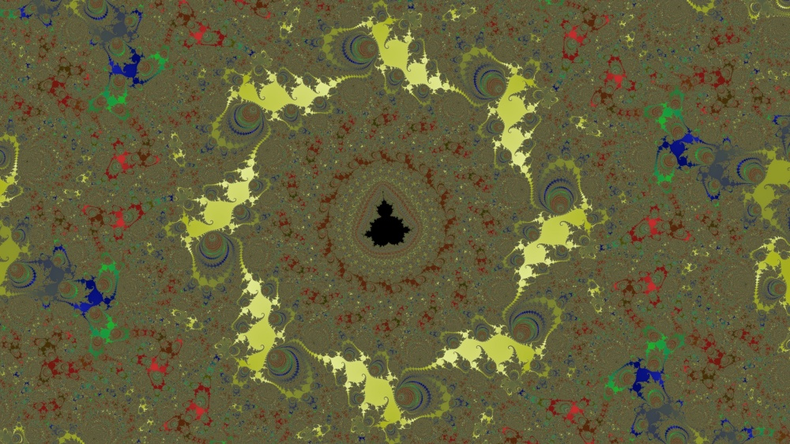
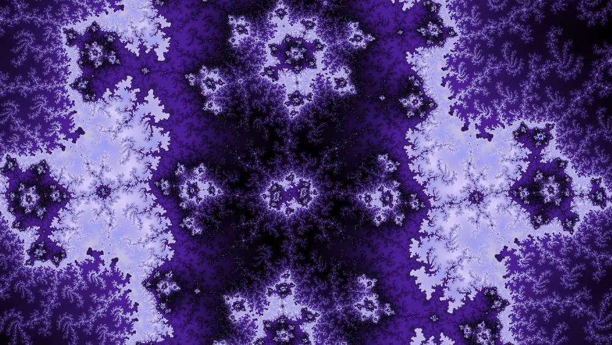
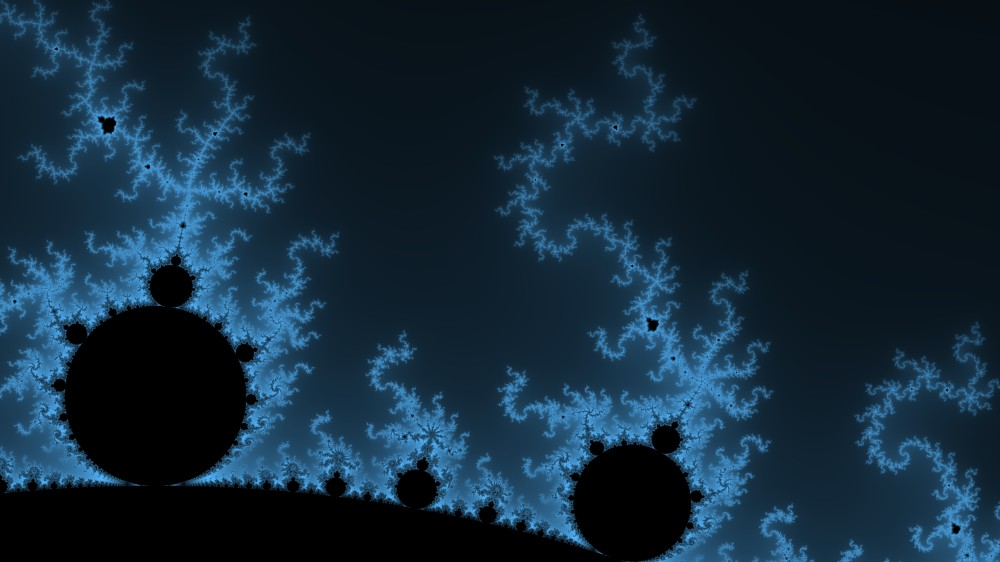
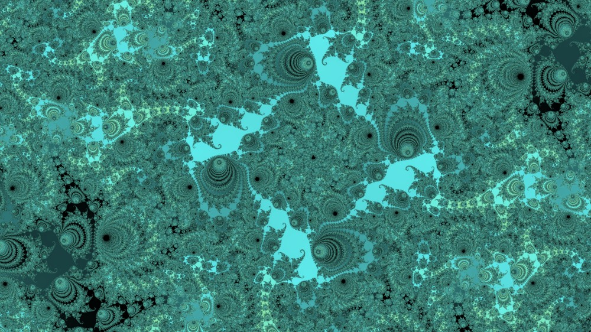
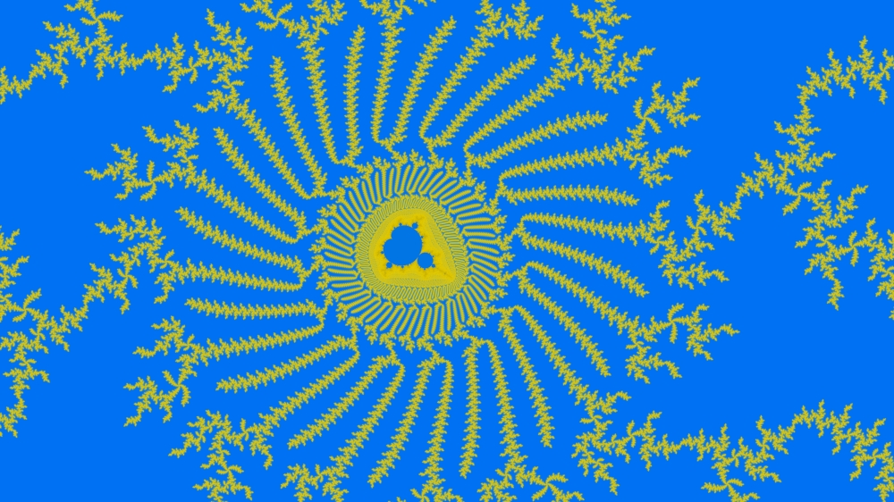
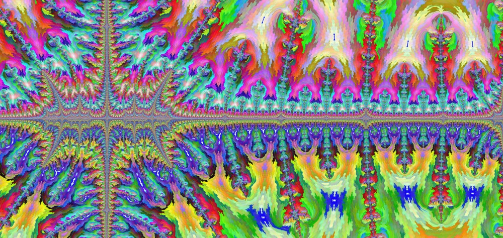

# A WebGL-based mandelbrot set explorer for desktop web browsers

[http://mandelset.ru](http://mandelset.ru)

## Features:
* Renders on the GPU using WebGL 2.0
* Can zoom up to the depth of about 2e-30
* Utilizes the perturbation method, which allows it render faster and create deeper zooms than what the default single presicion float of WebGL 2.0 would allow
* Supports multisampling to get smoother images
* Allows to color the rendered fractal without completely re-rendering it
* Smooth panning and zooming without waiting for the new view to render completely

## Gallery

